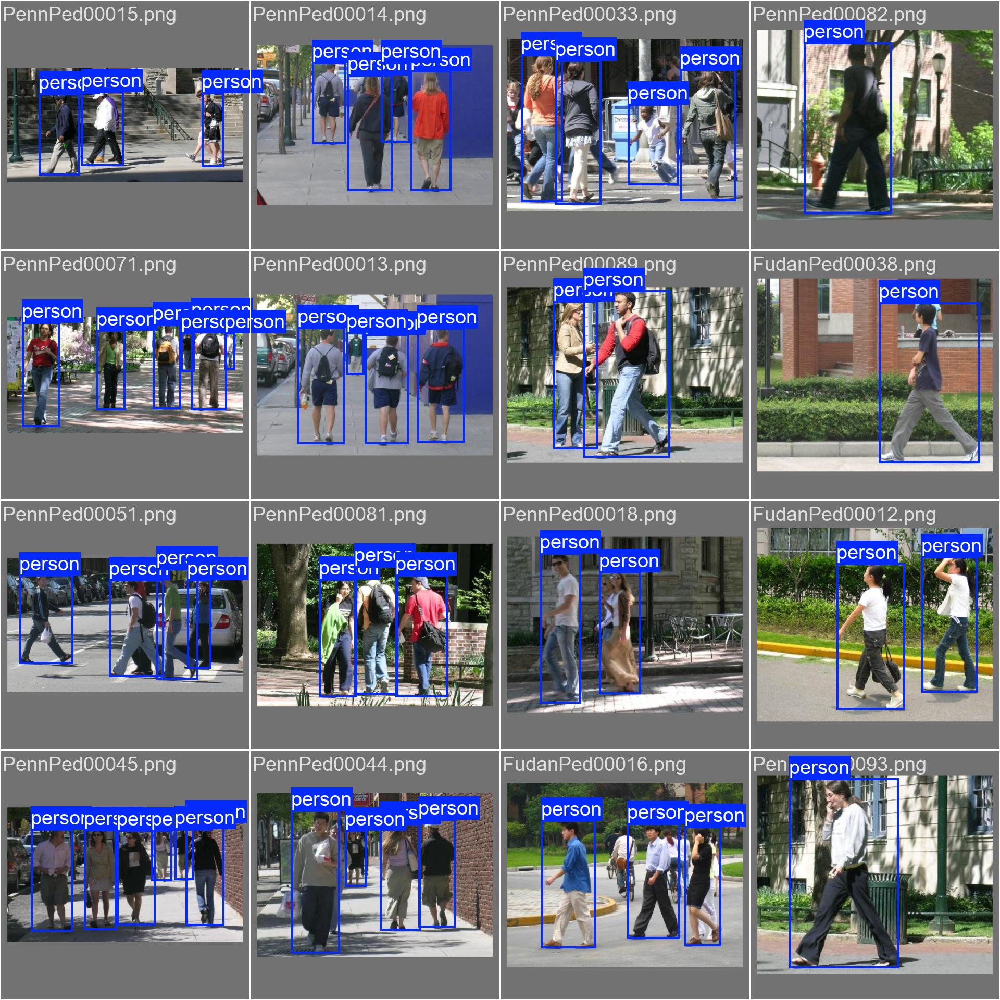
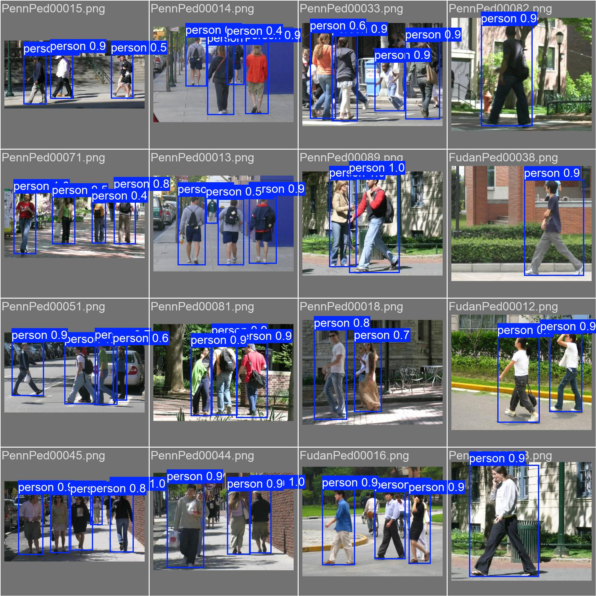
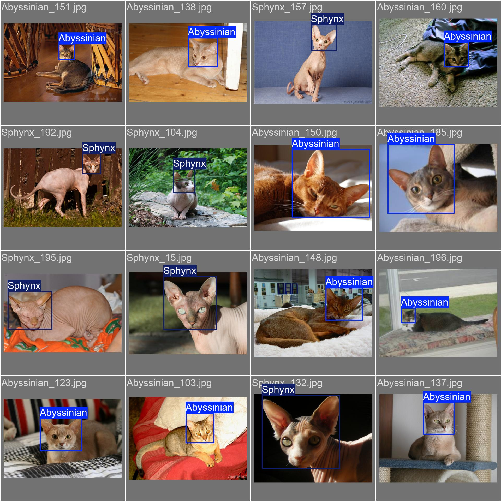
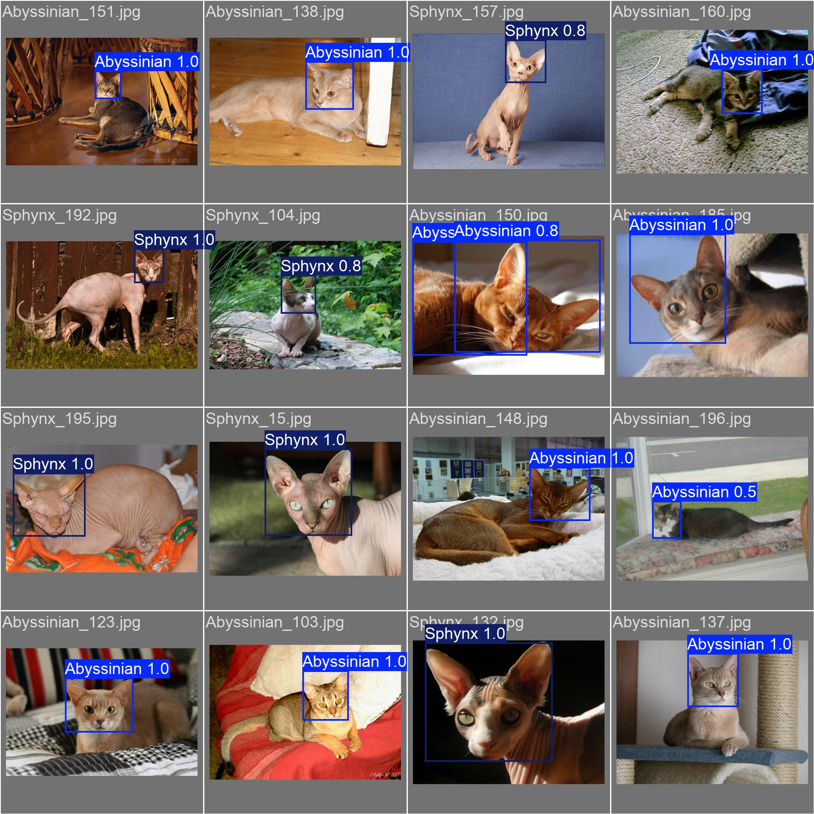

---

# **Deep Learning Assignment 2: Object Detection and Recognition**

# **1\. Introduction**

The primary objective of this assignment was to compare two different object detection models on two small datasets. This report presents the comparison of these architectures, Faster R-CNN and YOLOv8n, on the Penn-Fudan Pedestrian Dataset and Oxford-IIIT Pet Dataset under strict 8GB GPU memory constraints and limited data.

---

## 

## **2\. Dataset Description**

The following two datasets are used for this assignment:

1) **Penn-Fudan Pedestrian Dataset:** A small dataset containing approximately 170 images for pedestrian detection for a single class (person).  
2) **Oxford-IIIT Pet Dataset**: A moderately difficult dataset to detect and classify pet breeds. A subset of 5 breeds ("Abyssinian", "Beagle", "Chihuahua", "Pug", "Sphynx") is used to keep training within 8GB GPU limit.

---

## 

## **3\. Model Explanation**

The following two object detection models are used for this assignment:

1) **Faster R-CNN (MobileNetV3 Large FPN):** A two-stage detector. The lightweight MobileNet backbone ensures lower memory usage while maintaining strong feature extraction capabilities suitable for small datasets.  
2) **YOLOv8n:** A single-stage, anchor-free detector. The 'nano' version is extremely lightweight, designed for low-memory GPUs, and provides rapid training and inference.

---

## 

## **4\. Training Details**

Both datasets were split into 70% training, 15% validation, and 15% testing, with all images resized to 512x512. Transfer learning was used for both models using pretrained weights.

1) **Faster R-CNN (MobileNetV3 Large FPN):** Trained with a batch size of 4\. Mixed precision training was enabled to optimize GPU memory (However, I did train the model on my MAC, so I don’t think I was able to figure out the difference). This model was trained for 15 epochs on the Penn-Fudan dataset and 20 epochs on the Pet subset dataset.  
3) **YOLOv8n:** Trained with a batch size of 16\. It was trained for 15 epochs on the Penn-Fudan dataset and 20 epochs on the Pet subset dataset.

---

## 

## **4\. Final Results & Example Predictions**

### **Final Results Table**

| Dataset | Model | mAP@0.5 | Precision | Recall | Training Time | Inference Speed (img/s) |
| :---- | :---- | :---- | :---- | :---- | :---- | :---- |
| Penn-Fudan | Faster R-CNN | 0.945 | 0.859 | 0.779 | 562.29s | 7.15 |
| Penn-Fudan | YOLOv8n | 0.974 | 0.964 | 0.886 | 290.23s | 20.52 |
| Pets | Faster R-CNN | 0.967 | 0.896 | 0.789 | 747.65s | 7.19 |
| Pets | YOLOv8n | 0.962 | 0.963 | 0.972 | 433.22s | 23.93 |

### **Example Predictions**

|  |  |
| :---- | :---- |

*Fig: YOLOv8n model on Penn-Fudan dataset*

|  |  |
| :---- | :---- |

*Fig: YOLOv8n model on Pets subset dataset*

---

## 

## **5\. Discussion & Conclusion**

Looking at the detection accuracy, YOLOv8n achieved the highest mAP@0.5 on the Penn-Fudan dataset (0.974), while Faster R-CNN was slightly better on the Pets subset dataset (0.967). While I researched these two models, it said that Faster R-CNN is usually slightly more accurate but slower than YOLO, but in my results, YOLOv8n was faster and more accurate in almost both datasets.

However, when we look at the precision and recall of these two models, there’s a huge difference. YOLOv8n maintained higher precision and recall compared to Faster R-CNN in both datasets. This suggests that even if Faster R-CNN is effective in object detection, it is more prone to false positives.  

Now, when we look at computational time, there’s even a wider gap between these two models. YOLOv8n is nearly twice as fast as R-CNN for training the images. Moreover, YOLOv8n’s inference speed (\~21 images per second) is approximately 3 times faster than that of Faster R-CNN (\~7 images per second). This is because Faster R-CNN is slower due to its complex, iterative approach. 

### **Conclusion**

From these results, we can see that YOLOv8n is the better choice between these two object detection models. It provides more accurate results while also being faster and more precise. I ran all of these models on my personal computer (Mac), and I wasn’t able to utilize the mixed precision training. 

---

## **6\. How to run the code**

1) Clone the Github repo.  
2) Install the required dependencies present in the requirements.txt file

```py
pip install -r requirements.txt
```

3) Run the main.py

```py
python -u main.py
```
